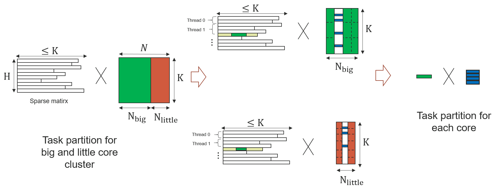

# Efficient-Sparse-Matrix-Matrix-Multiplication-on-asymmetric-CPUs
Focus on asymmetric CPU,Using mobile devices as a test.
## Environment&Main library
ubuntu 20.04  
c++11;  
pthread;  
Eigen::SparseMatrix;  
Eigen::DenseMatrix;  
Originalmat(customizable)  
## Three levels of task division

### Task Partition on core cluster
```c++   
std::pair<Originalmat,Originalmat> DenseClusterPartition(Originalmat& Densemat,float radio)  
```  
### Task Partition on Thread Level
```c++  
int* TaskPartition_Thread(SparseMatrixType SparseMatrix,int numthread)  
```  
### Task Partition on Intra-Thread  
```c++  
for(int W_i=W_o;(W_i<W_o+p->T_W)&&(W_i<(p->OuterIndex[H_o+1]));W_i++){
    for(int K_i=K_o;(K_i<K_o+p->T_K)&&(K_i<(p->col));K_i++){
        p->result[H_o*(p->numcol)+(p->startcol)+K_i]+=p->Value[W_i]*(p->DenseMatrix[p->InnerIndex[W_i]*(p->col)+K_i]);
}
} 
```  
## Cost Model
First,Considering memory accesses and degree of parallelism on latency  
## Run
```  
cd /{YouPath}/Efficient-Sparse-Matrix-Matrix-Multiplication-on-asymmetric-CPUs  
./build.sh  
```  
You will get amp-cpu  
Then,push the Executable files on your device  
```
adb push amp-cpu /{YouDeveicePath}
``` 
Next,Go to the directory where the executable file is located and Add permissions to the file
```  
adb shell  
cd /{YouDeveicePath}  
chmod +x amp-cpu  
```
Finally, run the executable file and you will get the result file  
``` 
./amp-cpu
```
